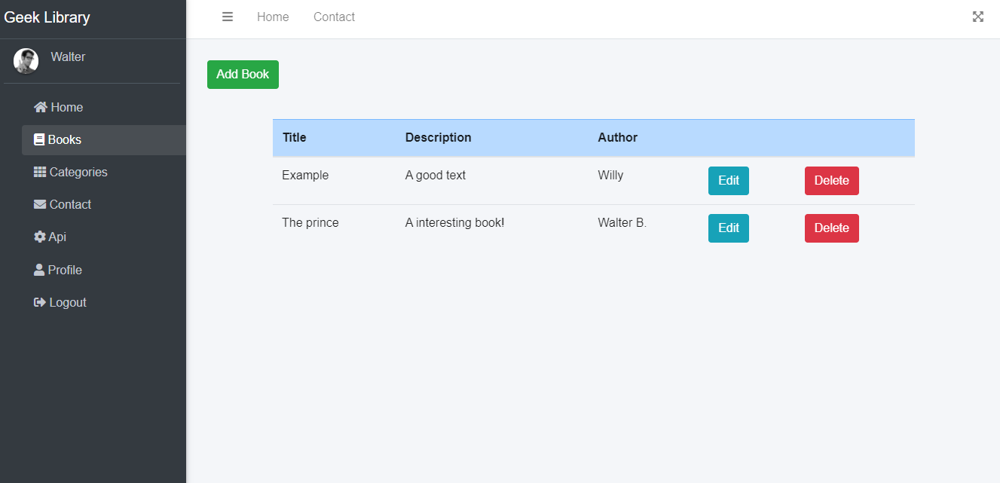

## Library Admin Panel 📕😎👍

This is a Admin Panel for a fiction library named 'Geek Library' it was built with the purpose to practice my Laravel skilks + the implementation of a front-end framework named "Vuejs" making it a Single-Page-Application.
I created a API with Laravel-Php to consume in the front-end, this same API can be consumed by another webpage.🙂😀

### Features ✔
* Login session using laravel default scaffolding.
* Create, Read, Update, Delete functionality API for Books & Categories.
* Single Page Application using VueJS front-end framework.
* Database One-to-Many relationship (Books-Categories).
* Using Admin Panel Template: AdminLTE.
* Responsive webpage.

## Build with 🛠️
* [MYSQL](https://www.mysql.com) - Data Base.
* [PHP-v8.0.0](https://www.php.net) - Backend Programming Language.
* [Bootstrap-4](https://getbootstrap.com) - Frontend styling framework.
* [Laravel 8.51.0](https://laravel.com) - Backend Framework.
* [VueJS-2.6.12](https://vuejs.org/) - Front-End Framework.
* [Authentication](https://laravel.com/docs/7.x/authentication) - Laravel default scaffolding.
* [AdminLTE](https://github.com/ColorlibHQ/AdminLTE) - Admin Panel Template.

### Author 
[@Dev-OriolCC](https://github.com/Dev-OriolCC)

## Screenshots and gifs 📸

### Login
Username: admin@gmail.com
Password: oriolcesar

